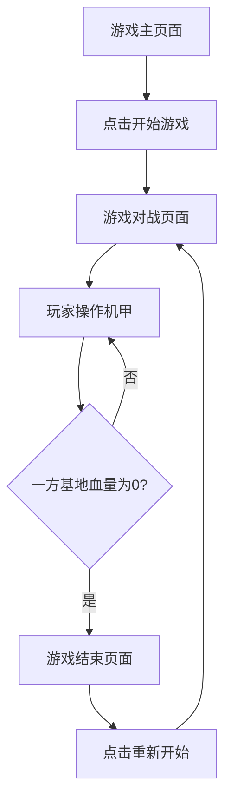

## 1. Product Overview
基于机甲大师3V3对抗赛规则的像素风对战小游戏，玩家可以控制机甲进行远程攻击，保护己方基地并攻击对方基地，通过战术对抗获得胜利。
- 游戏面向喜欢战术对战和像素风格的玩家，提供简单而富有策略性的游戏体验
- 游戏通过浏览器即可运行，无需安装，方便玩家快速开始游戏

## 2. Core Features

### 2.1 User Roles
| Role | Registration Method | Core Permissions |
|------|---------------------|------------------|
| Player 1 | No registration needed | Control机甲1进行游戏 |
| Player 2 | No registration needed | Control机甲2进行游戏 |

### 2.2 Feature Module
1. **游戏主页面**：游戏标题、开始游戏按钮、游戏规则说明
2. **游戏对战页面**：机甲角色、远程攻击、基地、胜利点显示、操作控制
3. **游戏结束页面**：显示胜负结果、重新开始按钮

### 2.3 Page Details
| Page Name | Module Name | Feature description |
|-----------|-------------|---------------------|
| 游戏主页面 | 游戏标题 | 显示游戏名称和像素风格的标题动画 |
| 游戏主页面 | 开始游戏按钮 | 点击后进入游戏对战页面 |
| 游戏主页面 | 游戏规则说明 | 显示游戏操作方法和规则 |
| 游戏对战页面 | 机甲角色 | 显示两个像素风格的机甲角色，支持移动、远程攻击 |
| 游戏对战页面 | 远程攻击 | 机甲可以发射弹丸攻击对方机甲和基地 |
| 游戏对战页面 | 基地 | 双方各有一个基地，基地有血量，血量为0时游戏结束 |
| 游戏对战页面 | 操作控制 | 玩家1使用WASD键控制移动，J键攻击；玩家2使用方向键控制移动，1键攻击 |
| 游戏对战页面 | 血量显示 | 显示两个机甲和两个基地的当前血量 |
| 游戏对战页面 | 胜负判定 | 当一方基地血量为0时，判定另一方获胜，显示游戏结束页面 |
| 游戏结束页面 | 胜负结果 | 显示获胜方信息 |
| 游戏结束页面 | 重新开始按钮 | 点击后重新开始游戏 |

## 3. Core Process
玩家进入游戏主页面，阅读游戏规则后点击开始游戏按钮进入对战页面。在对战页面中，两个玩家分别控制自己的机甲进行移动和远程攻击。目标是保护己方基地并攻击对方基地，当一方基地血量降至0时，游戏结束，显示游戏结束页面，玩家可以选择重新开始游戏。

## 4. User Interface Design
### 4.1 Design Style
- 主色调：深蓝色(#1a1a2e)和橙色(#ff7700)作为主要颜色，黑色(#000000)作为背景
- 按钮风格：像素风格，带有简单的3D效果和颜色渐变
- 字体：使用像素风格字体，如Press Start 2P
- 布局风格：居中布局，带有复古像素边框
- 图标风格：使用8位像素风格的图标和动画

### 4.2 Page Design Overview
| Page Name | Module Name | UI Elements |
|-----------|-------------|-------------|
| 游戏主页面 | 游戏标题 | 像素风格字体，大小为48px，颜色为#ff7700，带有简单的闪烁动画 |
| 游戏主页面 | 开始游戏按钮 | 像素风格按钮，大小为200x60px，颜色为#1a1a2e，边框为#ff7700，悬停时颜色变为#2a2a3e |
| 游戏主页面 | 游戏规则说明 | 像素风格字体，大小为16px，颜色为#ffffff，背景为半透明黑色 |
| 游戏对战页面 | 机甲角色 | 8位像素风格的机甲精灵，大小为64x64px，带有移动和攻击动画 |
| 游戏对战页面 | 弹丸 | 像素风格的弹丸，大小为8x8px，带有飞行动画 |
| 游戏对战页面 | 基地 | 像素风格的基地建筑，大小为100x100px |
| 游戏对战页面 | 操作控制 | 屏幕底部显示操作按钮提示，使用像素风格图标 |
| 游戏对战页面 | 血量显示 | 条形血条，颜色为#ff0000，背景为#333333，带有数字显示当前血量 |
| 游戏对战页面 | 胜负判定 | 全屏显示获胜方信息，使用大字体和简单的动画效果 |
| 游戏结束页面 | 胜负结果 | 像素风格字体，大小为32px，颜色为#ff7700，带有简单的闪烁动画 |
| 游戏结束页面 | 重新开始按钮 | 像素风格按钮，大小为200x60px，颜色为#1a1a2e，边框为#ff7700，悬停时颜色变为#2a2a3e |

### 4.3 Responsiveness
- 游戏采用桌面优先设计，支持1024x768及以上分辨率
- 游戏界面会根据窗口大小自动调整，保持居中布局
- 支持键盘操作，无需触摸优化

### 4.4 3D Scene Guidance
- 游戏使用2D像素风格，不需要3D场景
