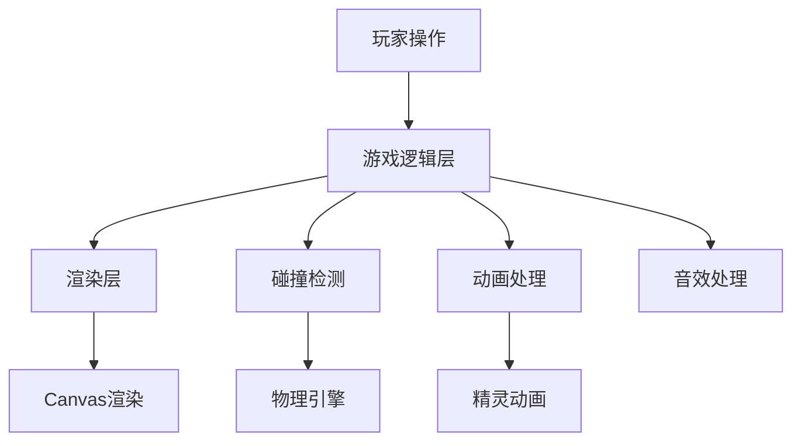
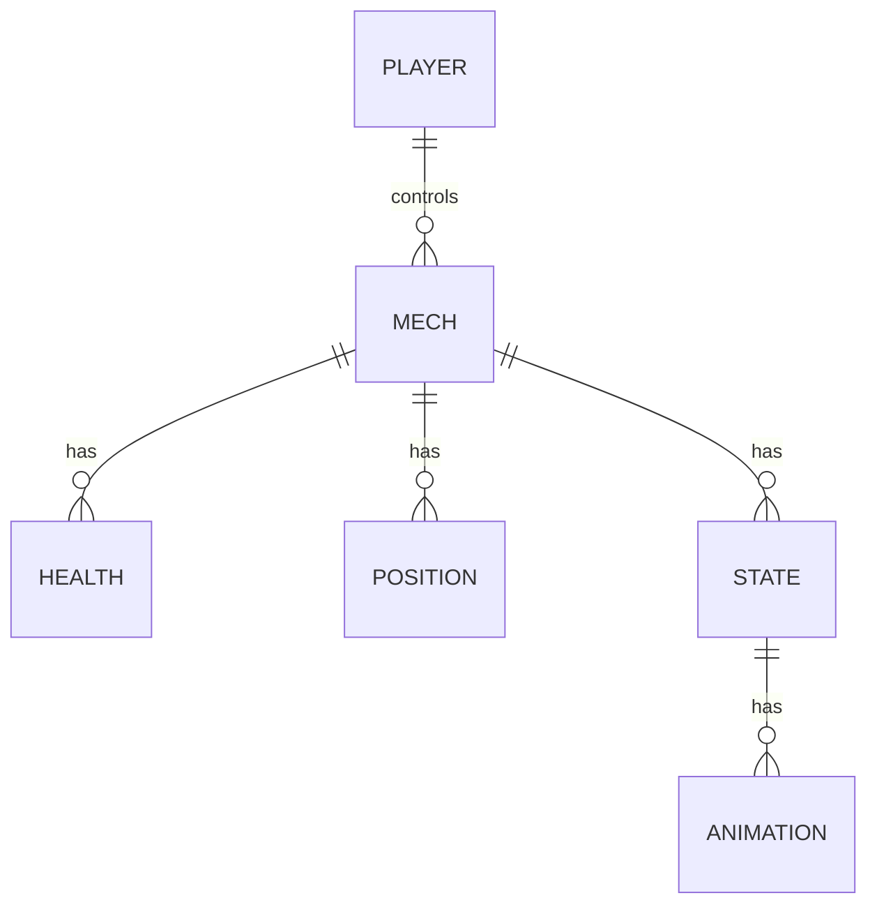

## 1. Architecture Design

## 2. Technology Description
- Frontend: React@18 + tailwindcss@3 + vite
- Initialization Tool: vite-init
- Backend: None (纯前端游戏)
- Database: None (游戏状态存储在内存中)

## 3. Route Definitions
| Route | Purpose |
|-------|---------|
| / | 游戏主页面 |
| /game | 游戏对战页面 |
| /gameover | 游戏结束页面 |

## 4. API Definitions
- 无后端API，游戏逻辑完全在前端实现

## 5. Server Architecture Diagram
- 无后端服务器架构

## 6. Data Model
### 6.1 Data Model Definition

### 6.2 Data Definition Language
- 游戏状态数据结构：
  - 玩家1：{ id: 1, health: 100, position: { x: 100, y: 300 }, direction: 'right', state: 'idle', animationFrame: 0 }
  - 玩家2：{ id: 2, health: 100, position: { x: 700, y: 300 }, direction: 'left', state: 'idle', animationFrame: 0 }
  - 游戏状态：{ isPlaying: false, winner: null, gameMode: 'versus' }

## 7. Game Logic Architecture
### 7.1 Core Components
- GameCanvas: 游戏主画布，负责渲染游戏场景和角色
- MechCharacter: 机甲角色组件，处理移动、攻击、防御逻辑
- HealthBar: 血量显示组件
- GameControls: 游戏控制组件，处理键盘输入
- GameStateManager: 游戏状态管理，处理游戏流程和胜负判定

### 7.2 Game Loop
1. 处理玩家输入
2. 更新游戏状态
3. 执行碰撞检测
4. 播放动画
5. 渲染游戏画面
6. 检查游戏结束条件

### 7.3 Collision Detection
- 使用轴对齐 bounding box (AABB) 碰撞检测
- 检测机甲之间的碰撞
- 检测攻击范围与目标的碰撞

### 7.4 Animation System
- 使用精灵图和帧动画实现角色动画
- 支持移动、攻击、防御等不同状态的动画
- 动画帧率控制在60fps

### 7.5 Input Handling
- 使用键盘事件监听处理玩家输入
- 玩家1：WASD移动，J攻击，K防御
- 玩家2：方向键移动，1攻击，2防御

### 7.6 Sound Effects
- 使用Web Audio API播放游戏音效
- 包括移动、攻击、防御、受伤、胜利等音效

## 8. Performance Optimization
- 使用requestAnimationFrame进行游戏循环，确保平滑的动画效果
- 精灵图预加载，减少游戏加载时间
- 使用Canvas绘制，提高渲染性能
- 碰撞检测优化，减少不必要的计算

## 9. Development Plan
1. 初始化React项目
2. 创建游戏主页面
3. 实现游戏画布和基本渲染
4. 添加机甲角色和动画
5. 实现移动、攻击、防御逻辑
6. 添加碰撞检测
7. 实现血量系统和胜负判定
8. 添加游戏结束页面
9. 优化游戏性能和用户体验
10. 测试游戏功能